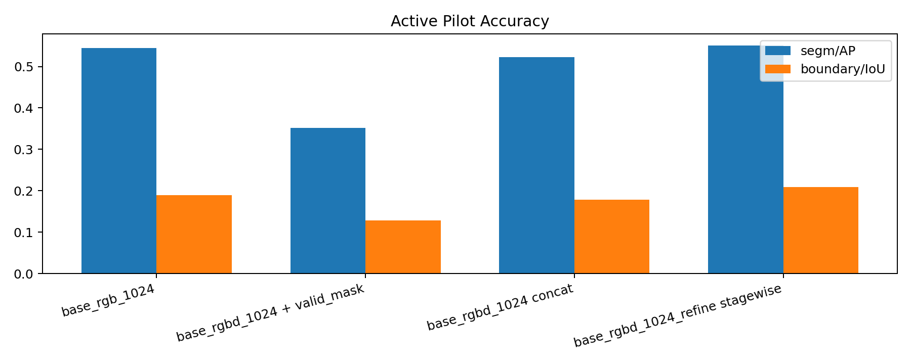
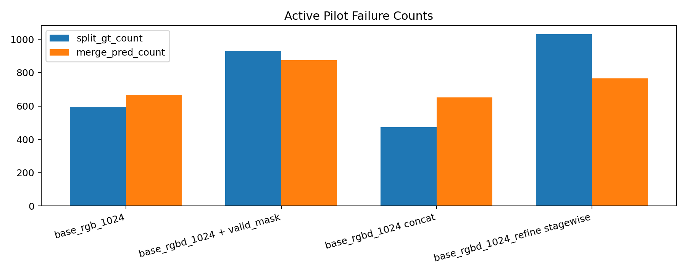

# 2026-03-28 Active Phase B/C Follow-up

## Scope

- This note updates the active instance-first story after two follow-up runs: `base_rgbd_1024` with `rgbd_concat_valid_mask`, and `base_rgbd_1024_refine` trained stagewise from the strongest existing raw RGB-D checkpoint.
- `base_rgb_1024` and `base_rgbd_1024 concat` are reused full-validation checkpoints.
- `base_rgbd_1024 + valid_mask` and `base_rgbd_1024_refine stagewise` use `1 epoch`, `128` train steps, `64` validation images for checkpoint selection, then a separate full-validation evaluation of the best checkpoint.
- The compact machine summary is in [2026-03-28-active-followup-phasebc-table.md](2026-03-28-active-followup-phasebc-table.md). Rescue-module debugging still lives in [2026-03-28-active-rescue-debug-summary.md](2026-03-28-active-rescue-debug-summary.md).

## Main Table

| Run | segm/AP (%) | bbox/AP (%) | boundary/IoU (%) | split_gt_count | merge_pred_count | refine rate (%) |
| --- | ---: | ---: | ---: | ---: | ---: | ---: |
| `base_rgb_1024` | 54.51 | 49.34 | 18.94 | 593 | 668 | 0.00 |
| `base_rgbd_1024` concat | 52.31 | 46.31 | 17.83 | 474 | 651 | 0.00 |
| `base_rgbd_1024` + valid mask | 35.21 | 31.11 | 12.80 | 929 | 876 | 0.00 |
| `base_rgbd_1024_refine` stagewise | 55.10 | 47.00 | 20.86 | 1031 | 765 | 13.59 |

## What Changed

- Raw `rgbd_concat` is now the clear Phase B winner. It still trails `base_rgb_1024` a little on AP and boundary quality, but it stays in the same range and actually lowers both split and merge counts.
- `rgbd_concat_valid_mask` does not earn promotion on this budget. Its full-validation `segm/AP` lands at `35.21`, far below raw concat `52.31`, and its split / merge counts both get worse.
- Stagewise refine is the first active follow-up that beats the previous winner. `base_rgbd_1024_refine` reaches `segm/AP 55.10` and `boundary/IoU 20.86`, which edges past both `base_rgb_1024` and raw `base_rgbd_1024`.

## Read Of The Failure Structure

- The refine stage improves mask quality, but it does not improve the failure counts yet. Both `split_gt_count` and `merge_pred_count` rise relative to raw concat.
- That means the refiner is sharpening and recovering boundaries, but it is still over-cutting crowded scenes often enough to pay a split penalty.
- In other words, Phase C is now a real gain on AP and boundary quality, but it is not a finished answer on instance consistency.

## Conclusion

- The active mainline should now be treated as `base_rgbd_1024_refine` on top of the strong raw-concat RGB-D base.
- `rgbd_concat_valid_mask` stays available as a public mode, but it is not the winner and should not replace raw concat in the active chain.
- Reference and graph stay in local-rescue debug status for now. The next fair rescue runs should start from this stronger stagewise refine checkpoint, not from the older scratch-like pilots.
