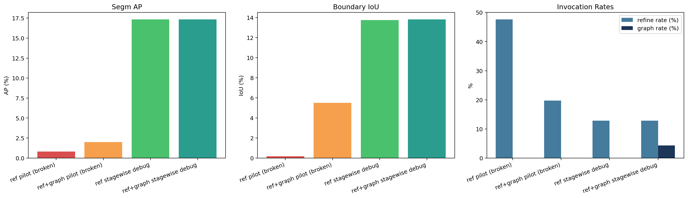

# 2026-03-28 Active Rescue Debug Summary

## Scope

- This note explains why the first `*_ref` / `*_ref_graph` pilots collapsed and records the corrected stagewise follow-up runs.
- The broken pilots are the original 128-step runs from `output/experiments/gisec_active_pilot_20260328/`.
- The corrected runs use two fixes together: normalized masked prototype depth on the reference branch, and stagewise training with `--init-checkpoint` plus a frozen backbone.

## Results Table

| Run | segm/AP | boundary/IoU | split_gt_count | merge_pred_count | refine rate | graph rate |
| --- | ---: | ---: | ---: | ---: | ---: | ---: |
| ref pilot (broken) | 0.80 | 0.17 | 155 | 4 | 47.62% | 0.00% |
| ref+graph pilot (broken) | 2.00 | 5.51 | 1092 | 564 | 19.76% | 0.00% |
| ref stagewise debug | 17.34 | 13.76 | 935 | 532 | 12.85% | 0.00% |
| ref+graph stagewise debug | 17.34 | 13.81 | 960 | 543 | 12.85% | 4.32% |

## Root Cause

- The original local-reference pilots were invalid. Raw prototype-bank depth included large sentinel values outside the mask, while the query branch used normalized depth. Under autocast, that poisoned the reference/fusion BatchNorm state and collapsed the reference-conditioned refiner.
- The original pilots also violated the intended stage order: later rescue stages were trained from scratch instead of on top of an earlier frozen winner.

## What The Corrected Runs Show

- After fixing prototype depth preparation and enforcing stagewise init + frozen backbone, the catastrophic collapse disappears. `base_rgbd_1024_refine_ref_stagewise_debug` recovers to `segm/AP 17.34`, essentially matching the refine-only pilot instead of collapsing to `0.80`.
- The corrected graph debug run also avoids collapse and now reaches `local_graph_invocation_rate 4.32%`, proving that graph rescue can finally fire in evaluation once the upstream reference branch is numerically sane.
- Even with those fixes, neither local reference nor local graph improves AP over refine-only on this short debug budget. In other words: the branch is now valid, but it still has not earned promotion.

## Conclusion

- The old `*_ref` and `*_ref_graph` pilot failures should not be used as evidence against rescue modules in principle; they were contaminated by a real numeric and stage-order bug.
- The corrected stagewise runs show the more useful conclusion: local reference and local graph are currently neutral-to-slightly-negative on this budget, not catastrophically broken, and they still need stronger training or redesign before promotion.
- The next justified mainline work remains `base_rgbd_1024` and `base_rgbd_1024_refine` under longer budgets. Rescue modules stay in debug/ablation mode until they beat refine-only on a clean stagewise setup.
