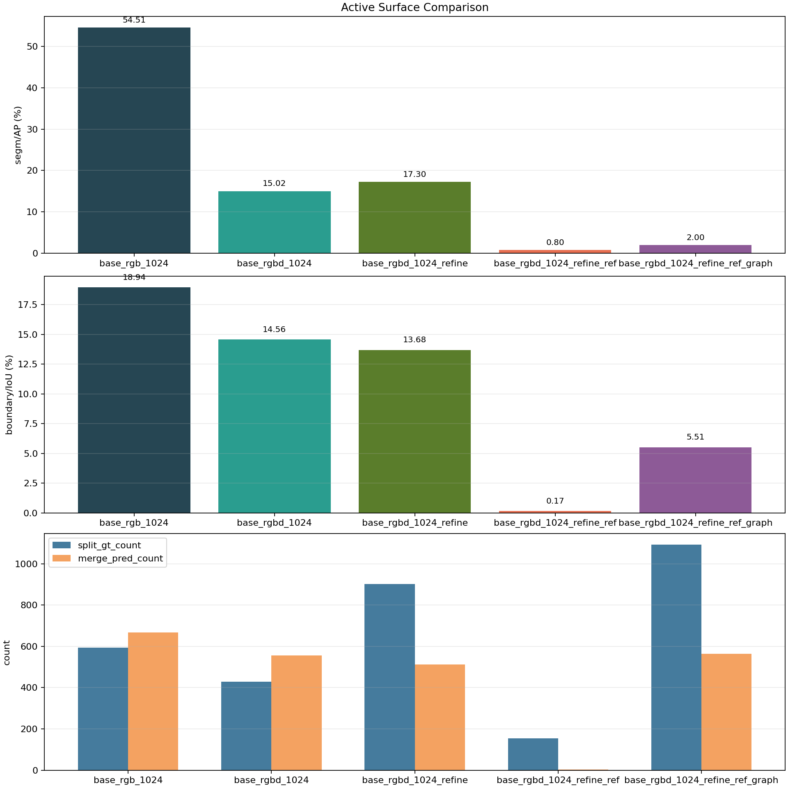

# 2026-03-28 Active Surface Pilot Summary

## Scope

- `base_rgb_1024` is a promoted full-eval result reused from the validated Phase A Mask2Former winner and re-evaluated on the new active surface.
- The remaining four rows are short active-surface pilots: `1 epoch`, `128 train steps`, `64` validation images.
- Because of that, only within-pilot directional comparisons are defensible for the RGB-D / refine / reference / graph rows.

## Metrics

| Variant | segm/AP (%) | boundary/IoU (%) | split_gt_count | merge_pred_count | refine rate (%) | graph rate (%) | Note |
| --- | ---: | ---: | ---: | ---: | ---: | ---: | --- |
| base_rgb_1024 | 54.51 | 18.94 | 593 | 668 | 0.00 | 0.00 | full eval, 149 images |
| base_rgbd_1024 | 15.02 | 14.56 | 428 | 556 | 0.00 | 0.00 | pilot, 128 train steps, 64 val images |
| base_rgbd_1024_refine | 17.30 | 13.68 | 902 | 512 | 12.85 | 0.00 | pilot, 128 train steps, 64 val images |
| base_rgbd_1024_refine_ref | 0.80 | 0.17 | 155 | 4 | 47.62 | 0.00 | pilot, 128 train steps, 64 val images |
| base_rgbd_1024_refine_ref_graph | 2.00 | 5.51 | 1092 | 564 | 19.76 | 0.00 | pilot, 128 train steps, 64 val images |

## Findings

- The promoted `base_rgb_1024` surface reproduces the validated Mask2Former Phase A winner: `segm/AP = 54.51`, `boundary/IoU = 18.94` on the full validation set.
- On the short pilot budget, adding raw RGB-D concat (`base_rgbd_1024`) is still well below the promoted RGB winner. This does not disprove RGB-D, but it means the RGB-D branch has not earned promotion yet on the active surface.
- The local refinement pilot (`base_rgbd_1024_refine`) improves pilot `segm/AP` over raw RGB-D (`17.30` vs `15.02`) and lowers `merge_pred_count` (`512` vs `556`), but it sharply raises `split_gt_count` (`902` vs `428`). On this pilot budget, refinement looks merge-reducing but split-inducing.
- The first local-reference pilot collapses badly (`segm/AP = 0.80`, `boundary/IoU = 0.17`). That is a negative result, not a marginal one.
- The graph-rescue pilot recovers a little from the failed reference-only branch (`segm/AP = 2.00`), but it is still far below the no-reference refine pilot. Also, `local_graph_invocation_rate = 0.00`, so this recovery cannot be credited to actual graph rescue firing in evaluation.
- The current ordered evidence still supports the plan sequence: strong backbone first, then RGB-D, then local refinement, while reference and graph remain unproven and should not be promoted.

## Recommended Wording

The instance-first surface cutover is now operational and the promoted `base_rgb_1024` path reproduces the validated Mask2Former@1024 backbone result on the new public interface. Short active-surface pilots show that naive RGB-D concat has not yet closed the gap to the promoted RGB backbone, while crop-local refinement improves pilot AP over RGB-D alone but shifts the failure profile from merges toward splits. In contrast, the first local-reference and local-reference-plus-graph pilots do not earn promotion: the reference branch collapses sharply, and the graph branch does not meaningfully recover under the same budget, with graph invocation remaining effectively zero in evaluation. At this stage the ordered mainline remains justified: freeze the strong RGB backbone, continue winner-only RGB-D and refinement work, and keep reference / graph in local-rescue status until they prove value on top of a stable backbone.

## Next Actions

- Run a longer `base_rgbd_1024` experiment before making a final RGB-D promotion decision.
- Keep split / merge metrics in the main table; the refinement pilot changes that failure structure in a meaningful way.
- Treat `*_ref` and `*_ref_graph` as blocked branches until graph invocation becomes non-zero and reference conditioning stops collapsing the crop module.
