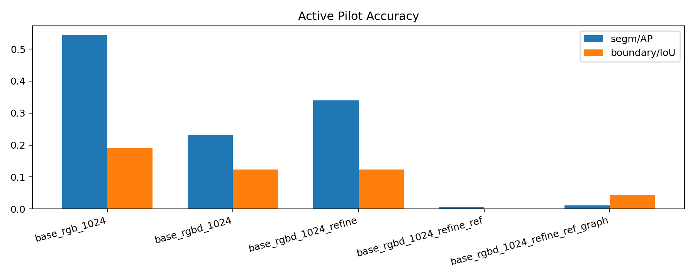
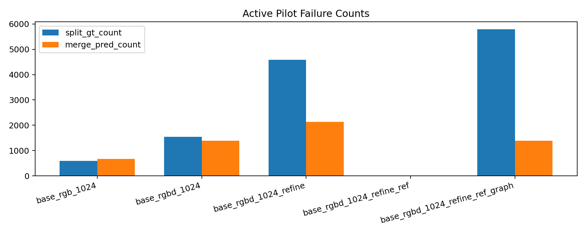

# 2026-03-28 GISEC Active Pilot

## Scope

This note records the first active-surface pilot after the instance-first cutover.

- `base_rgb_1024` is a full-val re-evaluation of the existing Phase A winner checkpoint under the new active surface.
- `base_rgbd_1024`, `base_rgbd_1024_refine`, `base_rgbd_1024_refine_ref`, and `base_rgbd_1024_refine_ref_graph` are short-budget pilots:
  - `epochs = 2`
  - `max_train_steps = 48`
  - checkpoint selection on `16` validation images
  - final reporting on the full validation split

That means the RGB-D and rescue rows are useful mechanism checks, not final paper numbers.

## Charts

The machine-readable table is in [2026-03-28-gisec-active-pilot.json](2026-03-28-gisec-active-pilot.json).
The compact markdown table is in [2026-03-28-gisec-active-pilot-table.md](2026-03-28-gisec-active-pilot-table.md).

## Main Results

- `base_rgb_1024`: `segm/AP = 0.5451`, `bbox/AP = 0.4934`, `boundary/IoU = 0.1894`
- `base_rgbd_1024`: `segm/AP = 0.2317`, `bbox/AP = 0.2767`, `boundary/IoU = 0.1233`
- `base_rgbd_1024_refine`: `segm/AP = 0.3393`, `bbox/AP = 0.3704`, `boundary/IoU = 0.1235`
- `base_rgbd_1024_refine_ref`: `segm/AP = 0.0069`, `bbox/AP = 0.0099`, `boundary/IoU = 0.0000`
- `base_rgbd_1024_refine_ref_graph`: `segm/AP = 0.0107`, `bbox/AP = 0.0096`, `boundary/IoU = 0.0441`

## Conclusions

1. The active surface is now numerically faithful to the promoted Phase A winner.
   The re-evaluated `base_rgb_1024` row reproduces the prior strong Mask2Former result instead of drifting due to the new CLI or checkpoint format.

2. Short-budget RGB-D is not yet justified on the winner backbone.
   `base_rgbd_1024` is far below `base_rgb_1024` on `segm/AP`, `bbox/AP`, and `boundary/IoU`.
   The current raw concat path is therefore still an open question, not a promoted gain.

3. Local refinement helps relative to short-budget RGB-D base, but it does not recover the RGB winner.
   `base_rgbd_1024_refine` improves materially over `base_rgbd_1024`, which supports the instance-first ordering.
   It still remains well below `base_rgb_1024`, so the refinement stage is not yet strong enough to justify pushing the whole stack forward.

4. Local reference rescue is currently unstable.
   `base_rgbd_1024_refine_ref` collapses almost completely in this pilot.
   That means reference re-entry is not ready for promotion and needs targeted debugging before more budget is spent on it.

5. Local graph rescue is also not ready.
   `base_rgbd_1024_refine_ref_graph` remains near zero AP, and `local_graph_invocation_rate = 0.0` on the full-val run.
   In the current implementation and short budget, the graph head is not contributing useful recovery behavior.

## Practical Read

- Current winner remains `base_rgb_1024`.
- Next justified engineering step is not `reference` or `graph`.
- Next justified step is to debug why short-budget `rgbd_concat` drops so sharply on the Mask2Former winner, then rerun the local refiner on a stronger RGB-D checkpoint.
- `reference` and `graph` should stay in pilot/debug status until they stop collapsing under this controlled active pipeline.
