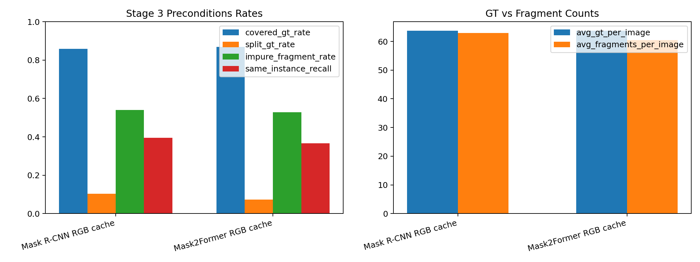

> **Historical Naming Notice**: This document uses the pre-rename naming convention (abbreviated stage/variant/phase codes). For the current mapping, see the "Variant Naming Reference" table in README.md.

**Historical Naming Notice**: This document uses the pre-rename naming convention (abbreviated stage/variant/phase codes). For the current mapping, see the "Variant Naming Reference" table in README.md.

# 2026-03-29 Phase 3 Prerequisite Diagnostics

## Scope

The long-term goal is unchanged:

- beat traditional RGB/RGB-D segmentation in stacked electronic components
- beat the previous `Magformer` line with a smaller RGB GISEC first
- then push the final system past `AP 80`

This note answers one narrower question inside the current `Phase 3 graph-to-instance` sub-project:

- does the current first-stage fragment set actually satisfy the assumptions needed for Stage 3 graph merging?

The compact machine summary is in [2026-03-29-phase3-prerequisite-diagnostics.json](2026-03-29-phase3-prerequisite-diagnostics.json).  
The compact table is in [2026-03-29-phase3-prerequisite-diagnostics-table.md](2026-03-29-phase3-prerequisite-diagnostics-table.md).

## Main Table

| Branch | Avg GT / Image | Avg Fragments / Image | Covered GT Rate | Split GT Rate | Singleton GT Rate | Impure Fragment Rate | Same-Instance Recall | Positive Edge Ratio |
| --- | ---: | ---: | ---: | ---: | ---: | ---: | ---: | ---: |
| `Mask R-CNN RGB cache` | 63.68 | 63.00 | 0.8588 | 0.1035 | 0.7553 | 0.5403 | 0.3949 | 0.0548 |
| `Mask2Former RGB cache` | 63.68 | 60.49 | 0.8687 | 0.0737 | 0.7950 | 0.5289 | 0.3655 | 0.0350 |

## Is The User’s Line Of Thinking Correct?

Yes, mostly.

But the right condition is a little more precise than “the first-stage masks must be a subset of the true mask set.”

What Stage 3 actually needs is this:

- each fragment should stay inside one GT instance as much as possible
- the union of fragments should still cover the GT set well
- some GT instances must be split into multiple fragments, otherwise there is nothing useful to merge
- the graph builder must expose enough same-instance candidate edges, otherwise the graph head cannot reconnect split pieces even if they exist

So your premise is correct in spirit. The graph stage only helps if Stage 1/2 creates `mergeable` fragments, not just any masks.

## What The Current Data Says

Three facts matter most.

First, coverage is not complete:

- about `13% to 14%` of GT instances are missing from the fragment set entirely

Second, split opportunity is limited:

- only about `7% to 10%` of GT instances are split into at least two fragments
- about `76% to 80%` of GT instances appear as single-fragment cases already

Third, candidate merge edges are sparse:

- same-instance pair recall is only about `0.37 to 0.39`
- positive edge ratio is only about `0.035 to 0.055`

So the current Stage 3 premise only holds partially. The graph branch is not starting from a dense, fine fragment set. It is starting from a fragment set that is already close to one fragment per GT, still misses some GTs, and still has non-trivial leakage.

## Most Important Insight

The current RGB graph-cache path is not really giving Stage 3 a rich fragmentization problem.

In the present code path:

- `build_baseline_graph_cache.py` exports the backbone masks
- `build_graph_cache_sample_from_masks(...)` turns those predicted masks into the graph fragments

That means the graph is mostly asked to merge `whole predicted masks`, not a deliberately dense set of within-instance pieces.

This explains why Stage 3 recovered from the export bug but still does not approach the Phase 1 backbone AP:

- there is not much valid merge work to do
- and the mergeable positive edges that do exist are not recalled well enough

## Grounded Model-Side Moves

The most grounded next moves in this codebase are these.

### 1. Add direct Stage 2 validation metrics

This should happen regardless of the next model change.

The current splitter training only reports:

- `loss_single`
- `loss_count`
- `loss_center`

That is not enough. Stage 2 should report the same kinds of metrics this note uses:

- `covered_gt_rate`
- `split_gt_rate`
- `singleton_gt_rate`
- `impure_fragment_rate`

Without those, Stage 2 can look healthy while still failing the Stage 3 premise.

### 2. If Phase 3 needs real fragments, Stage 2 must output real fragments

Right now `ReferenceLocalSplitter` predicts:

- `single_object_logit`
- `count_logits`
- `center_heatmap`

It does **not** predict fragment masks.

So if we want “dense within-instance fragments without cross-instance bridges,” the next structural move is not another graph loss. It is to add an explicit `fragment mask` or `boundary / split` head to the Stage 2 splitter and train it against instance-map-derived fragment quality.

### 3. Purity / containment supervision belongs before the graph

If we want the Stage 1/2 fragment set to stay inside true objects, the most grounded extra loss is a `containment` style loss on the fragment generator:

- penalize fragments that overlap more than one GT instance
- reward higher per-fragment purity

That fits the current cache statistics directly.

### 4. Merge-recall supervision belongs at the graph boundary

Once the fragment set is better, the graph branch should be judged by:

- same-instance candidate edge recall
- fraction of singleton clusters after merge

That is a better next graph target than just edge BCE alone.

## Practical Conclusion

- Your line of thinking is correct.
- The current Phase 3 weakness is not only in Stage 3 itself.
- The present first-stage fragment set does not fully satisfy the graph stage premise.
- The next real progress path is:
  - keep the RGB-first backbone fixed
  - add direct Stage 2 prerequisite metrics
  - then make Stage 2 emit actual dense fragment masks or split boundaries before asking Stage 3 to merge them
