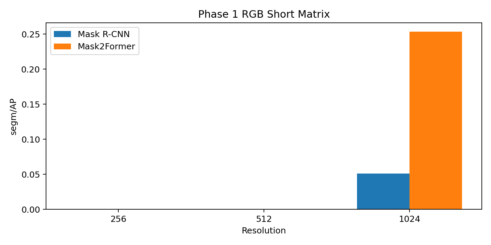

> **Historical Naming Notice**: This document uses the pre-rename naming convention (abbreviated stage/variant/phase codes). For the current mapping, see the "Variant Naming Reference" table in README.md.

# 2026-03-29 RGB Phase 1 Backbone Summary

## Current Sub-Project

The current sub-project is the `RGB-first Phase 1 backbone benchmark and public-surface reset`.

This phase is only about the first-stage backbone choice. It is not yet the phase for RGB-D fusion, local refinement, reference rescue, or graph rescue to take over the main story.

## Exact Artifacts

- short matrix root: `output/experiments/baselines/phase_a_rgb_short_20260327/`
- full 1024 root: `output/experiments/baselines/phase_a_rgb_full_20260327/`
- machine summary: [2026-03-29-rgb-phase1-backbone-summary.json](2026-03-29-rgb-phase1-backbone-summary.json)
- compact table: [2026-03-29-rgb-phase1-backbone-summary-table.md](2026-03-29-rgb-phase1-backbone-summary-table.md)

## Results

### Short matrix

- `Mask R-CNN RGB @256`: `segm/AP 0.00`
- `Mask R-CNN RGB @512`: `segm/AP 0.00`
- `Mask R-CNN RGB @1024`: `segm/AP 5.11`
- `Mask2Former RGB @256`: `segm/AP 0.00`
- `Mask2Former RGB @512`: `segm/AP 0.00`
- `Mask2Former RGB @1024`: `segm/AP 25.34`

### Full 1024 runs

- `Mask R-CNN RGB @1024`: `segm/AP 51.94`, `bbox/AP 49.08`, `boundary/IoU 14.70`, `FPS 11.44`
- `Mask2Former RGB @1024`: `segm/AP 54.59`, `bbox/AP 49.33`, `boundary/IoU 18.94`, `FPS 11.69`

## Conclusion

- `Mask2Former RGB @1024` is the Phase 1 winner.
- `Mask R-CNN RGB @1024` is the benchmark companion.
- `1024` is required. `256` and `512` are not serious settings for this dataset under the current protocol.

## Why RGB-D Is Later

- The RGB backbone decision is already clean enough without widening the surface.
- The recent RGB-D follow-up did not produce a large enough gain to replace the simpler RGB Phase 1 story.
- So RGB-D stays as a later branch on top of the RGB winner, not as the front-door Phase 1 answer.

## Next Step

- Keep `Mask2Former RGB @1024` as the mainline base model.
- Keep `Mask R-CNN RGB @1024` as the comparison anchor.
- Resume later modules and later fusion work only after this RGB-first Phase 1 conclusion stays fixed.
**Historical Naming Notice**: This document uses the pre-rename naming convention (abbreviated stage/variant/phase codes). For the current mapping, see the "Variant Naming Reference" table in README.md.
