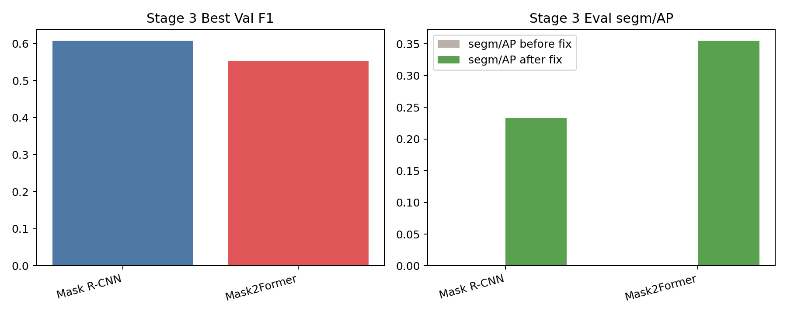

# 2026-03-29 RGB Weekend Pipeline Summary

## Scope

This note updates the current `Phase 3 graph-to-instance debug` sub-project inside the RGB-first GISEC line.

The long-term goal is unchanged:

- beat traditional RGB/RGB-D segmentation in stacked electronic components
- beat the previous `Magformer` line with a smaller RGB GISEC first
- then push the final system past `AP 80`

This milestone is only about the first verified Stage 3 failure mode:

- Stage 2: train the RGB reference splitter
- Stage 3: explain why graph validation F1 was useful while final eval AP collapsed to zero
- Stage 3: rerun eval after fixing the first verified export bug

The machine summary is in [2026-03-29-rgb-weekend-pipeline-summary.json](2026-03-29-rgb-weekend-pipeline-summary.json).

## Stage 2

Reference splitter training completed successfully:

- `loss_total = 0.1504`
- `loss_single = 0.0616`
- `loss_count = 0.0604`
- `loss_center = 0.0284`
- `wall_time_sec = 5116`

Artifacts:

- `output/experiments/rgb_weekend_pipeline_20260328/reference_splitter_rgb_stage2/train_summary.json`
- `output/experiments/rgb_weekend_pipeline_20260328/reference_splitter_rgb_stage2/model_final.pth`

## Stage 3 Before And After The Fix

| Model | Val F1 | Eval Threshold | segm/AP Before Fix | segm/AP After Fix | bbox/AP After Fix | Predictions |
| --- | ---: | ---: | ---: | ---: | ---: | ---: |
| `Mask R-CNN RGB` | 0.6078 | 0.125 | 0.0000 | 0.2327 | 0.2760 | 8695 |
| `Mask2Former RGB` | 0.5527 | 0.100 | 0.0000 | 0.3552 | 0.3514 | 8539 |

## Root Cause

- The first verified Stage 3 root cause was not in the graph head itself. It was in the export path.
- Stage 3 eval was writing merged instance masks at fragment / feature-map resolution, for example `200x200` or `256x256`, while the dataset images and annotations are `1024x1024`.
- Edge validation F1 could still look useful under that bug, but COCO AP crashed because the final masks were on the wrong canvas.

## What Was Fixed

- `baseline/reference_graph/eval_pipeline.py` now upsamples the merged label map back to the original image size before COCO export.
- `tests/test_reference_graph_eval.py` now has a regression test that fails if a smaller cached fragment map is exported directly against a larger image.
- The eval CLI also prefers the validation-selected threshold before the training summary threshold.

## Conclusion

- The zero-AP collapse was real, but the first cause is now fixed. Stage 3 no longer evaluates at `0 AP`.
- `Mask2Former RGB` is still the stronger Phase 3 branch after the fix, reaching `segm/AP 35.52`, above `Mask R-CNN RGB` at `23.27`.
- Even after the fix, Stage 3 is still well below the Phase 1 RGB backbone numbers. So this is a recovery milestone, not a promotion milestone.
- Phase 2 still needs more intuitive validation metrics later. The current splitter loss is useful, but it is not yet a direct enough quality read. That remains a later cleanup item after the main Phase 3 blocker.

## Next Step

- Keep the RGB-first mainline and do not promote the current Stage 3 graph branch yet.
- The next Phase 3 question is narrower now: after fixing mask-size export, what still keeps Stage 3 far below the Phase 1 RGB backbone AP?
- The most likely next debug targets are merge scoring, score calibration, and over-fragmented prediction count, not the graph preview or mask canvas contract anymore.
