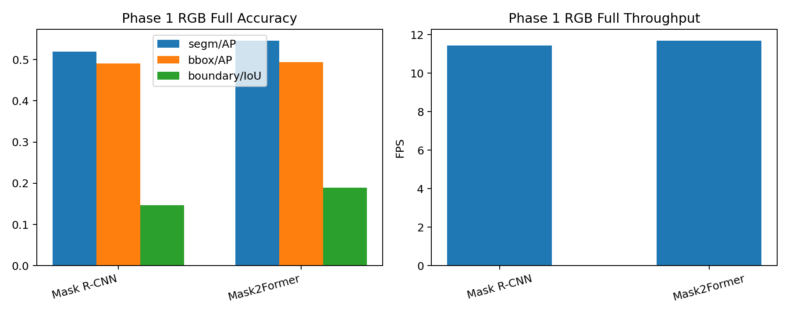
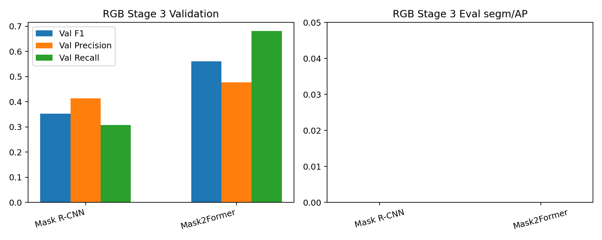

# 2026-03-29 RGB Weekend Pipeline Summary

## Scope

- This note continues the `RGB-first weekend pipeline` after the preview-render crash was fixed.
- It reuses the existing RGB backbone winners from Phase 1:
  - `mask_rcnn_r50_1024_phasea_full`
  - `mask2former_swin_t_1024_phasea_full`
- It then records:
  - Stage 2 reference-splitter training
  - Stage 3 Mask R-CNN reference-graph validation and eval
  - Stage 3 Mask2Former reference-graph validation and eval

The compact machine summary is in [2026-03-29-rgb-weekend-pipeline-summary.json](2026-03-29-rgb-weekend-pipeline-summary.json).  
The compact table is in [2026-03-29-rgb-weekend-pipeline-summary-table.md](2026-03-29-rgb-weekend-pipeline-summary-table.md).

## Backbone Reminder

- `Mask2Former RGB @1024` remains the best Phase 1 backbone: `segm/AP 54.59`, `boundary/IoU 18.94`
- `Mask R-CNN RGB @1024` remains the benchmark companion: `segm/AP 51.94`, `boundary/IoU 14.70`

That backbone conclusion did not change in this weekend pipeline.

## Stage 2

- The RGB reference splitter trained successfully:
  - `epochs = 10`
  - `steps = 165070`
  - `loss_total = 0.1504`
  - `wall_time_sec = 5116`

This means the pipeline is no longer blocked before the graph stage.

## Stage 3

| Model | Best Threshold | Val F1 | Val Precision | Val Recall | Eval segm/AP | Eval FPS | Predictions |
| --- | ---: | ---: | ---: | ---: | ---: | ---: | ---: |
| `Mask R-CNN` | 0.10 | 0.3529 | 0.4138 | 0.3077 | 0.0000 | 51.91 | 9024 |
| `Mask2Former` | 0.15 | 0.5614 | 0.4772 | 0.6815 | 0.0000 | 50.34 | 8606 |

## What Changed

- The preview-only shape bug is fixed. The weekend pipeline now runs through the Stage 3 train and eval steps instead of dying inside preview rendering.
- `Mask2Former` learns a clearly stronger Stage 3 validation graph than `Mask R-CNN`. Its validation `F1` rises from `0.3529` to `0.5614`.
- But neither Stage 3 branch converts that into final instance AP. Both final eval runs land at `segm/AP = 0.0`.

## Practical Conclusion

- The RGB-first backbone decision is stable. `Mask2Former RGB @1024` still holds the line as the correct Phase 1 winner.
- The current RGB Stage 3 graph branch is not ready for promotion. The graph model can learn something useful at edge-validation level, especially on `Mask2Former`, but the current decode or merge path still fails to produce usable instance outputs.
- The next useful question is no longer “which RGB backbone wins?” That is already settled. The next useful question is “why does Stage 3 collapse at final eval even when validation F1 improves so much?”

## Next Step

- Keep `Mask2Former RGB @1024` as the mainline base.
- Keep `Mask R-CNN RGB @1024` as the comparison branch.
- Treat the Stage 3 weekend result as a debugging milestone, not a promoted model result.
- Debug the graph-to-instance export path before spending more budget on reference or RGB-D fusion.
